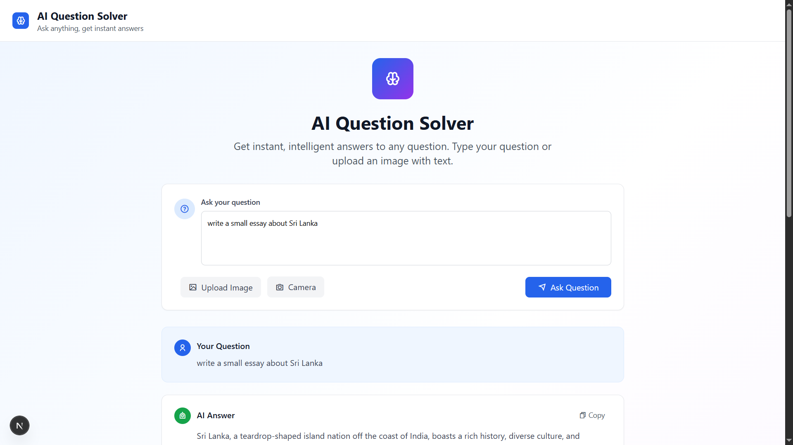
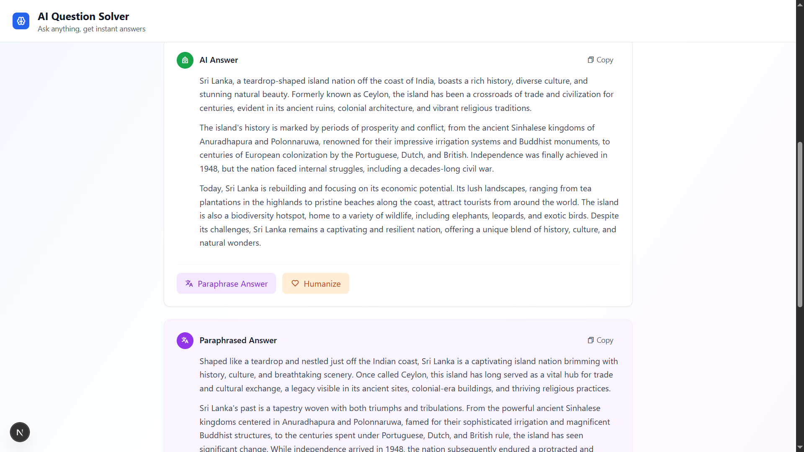
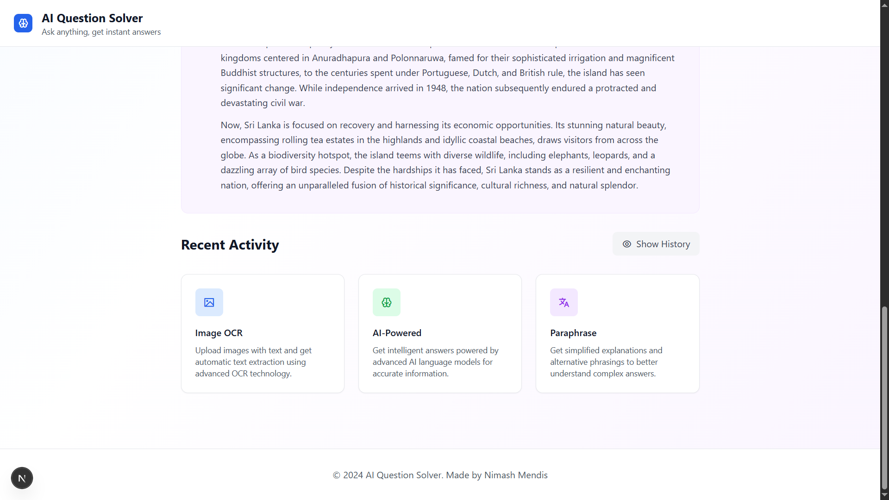

# AI Question Solver Web App

A Next.js web application leveraging the Gemini API to provide advanced AI-powered question solving with paraphrasing and humanizing capabilities.

---

## Table of Contents

- [Overview](#overview) 
- [Images](#images) 
- [Features](#features)  
- [Demo](#demo)  
- [Technology Stack](#technology-stack)  
- [Getting Started](#getting-started)  
- [Usage](#usage)  
- [Contributing](#contributing)  
- [License](#license)  
- [Contact](#contact)

---

## Overview

This web app is designed to solve user-submitted questions using AI with enhanced paraphrasing and human-like response generation. It integrates the Gemini API to understand and generate responses that feel natural and easy to read.

Users can input questions or prompts, and the app returns:

- Precise answers
- Paraphrased explanations
- Humanized, conversational-style responses

---

## Images





## Features

- **AI Question Solving:** Get accurate answers to complex queries.
- **Paraphrasing:** Rewrites answers for clarity and uniqueness.
- **Humanizing Responses:** Makes answers sound natural and conversational.
- **Next.js Framework:** Fast, scalable, and SEO-friendly React-based web app.
- **Responsive Design:** Works seamlessly on both desktop and mobile devices.

---

## Demo

Add your live demo link here (if applicable):  
[https://your-demo-url.com](https://your-demo-url.com)

---

## Technology Stack

- **Next.js** - React framework for server-side rendering and static site generation
- **JavaScript** - Main programming language
- **Gemini API** - AI backend for question answering, paraphrasing, and humanizing responses
- **CSS/Styled Components/Tailwind (choose one)** - For styling UI (adjust based on your app)

---

## Getting Started

### Prerequisites

- Node.js (v14 or higher recommended)
- npm or yarn package manager
- Gemini API key (You need to sign up and get API credentials)

### Installation

1. Clone the repository:

```bash
git clone https://github.com/yourusername/ai-question-solver.git
cd ai-question-solver
```

2. Install dependencies:

npm install
# or
yarn install

3. Add your Gemini API key:

in lib/openai.js
add:
    const GEMINI_API_KEY = 'add your gemini api key here';

4. Run the development server:

npm run dev
# or
yarn dev

5. Open http://localhost:3000 in your browser to see the app.

## Usage
    
    Enter a question or prompt in the input field or you can enter image.

    Submit to get AI-generated answers.

    View paraphrased and humanized versions of the answer.

    Optionally, copy or share the responses.

## License
    
    This project is licensed under the MIT License. See the LICENSE file for details.

## Contact

    Created by Nimash Mendis. feel free to reach out email to nimash.mendis0202@gmail.com.